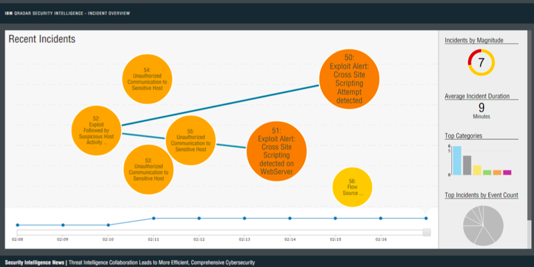

# ABOUT
This tool allows you to visualize all of the incidicents (offenses) on your QRadar installation. Each bubble represents an incidicent. The size and color of the bubble indicates the magnitude of the incident. Lines dawn between the incidents indicate there are shared IP addreses among the linked incidents. 

Clicking on an incident bubble allows you to see details of that incident at a glance.



# RUNNING THE QRADAR INCIDENT OVERVIEW
 
This project installation has Zero installation footprint on QRadar and lives on another host (separate OS/webserver/DB)
 
The installation contains three major steps
 
1.	Creating & Configuring a new host environment
2.	Configuring & Building the visualization app
3.	Configuring QRadar to talk to the visualization app
 
# CONFIGURING HOST ENVIRONMENT
This app can handily run in a VM. Consider using vSphere or VMWare Fusion.
 
## INSTALL UBUNTU
Download and install 14.04 / 14.10
 
If you're running on a VM, be sure and allocate the following hardware specs:
* Hardware
* HD Capacity: 50GB
* Memory: 4GB Ram
 
**PROCEED AS ROOT** 
Most of the following steps require you to be logged into Ubuntu as root.
```sh 
sudo su
```
 
## INSTALL GRADLE
```sh 
sudo apt-get update
sudo apt-get install gradle
``` 
## INSTALL POSTGRES
Install Postgres 9.2.1  (or latest: 9.4)
 
```sh 
sudo apt-get install postgresql postgresql-contrib
```

### User setup and Password
See: http://suite.opengeo.org/opengeo-docs/dataadmin/pgGettingStarted/firstconnect.html

To start off, we need to change the 'postgres' user password; we will not be able to access the server otherwise. As the “postgres” Linux user, we will execute the psql command.
 
```sh
sudo -u postgres psql postgres
```
 
Set a password for the "postgres" database role using the command:
 
```sh 
\password postgres
```

Set the NEW password to 'postgres' (or whatever you like. Remember this password).
 
```sh 
\q to exit psql
```

Also update pg_hba.conf to allow peer connections.
 
```sh 
sudo vi /etc/postgresql/9.4/main/pg_hba.conf
```

Change 127.0.0.1 to all
 
### Restart postgres
```sh 
service postgresql restart
```

The steps required to configure the database to store the data for this application will be coved in the "Create Visualization Database & Tables" section later in this guide.
 
## INSTALL JAVA 7
 
```sh 
sudo apt-get install openjdk-7-jdk
``` 
 
 
## INSTALL LIBERTY 8.5.5.4
 
Download two jars

wlp-developers-runtime.8.5.5.4.jar
https://public.dhe.ibm.com/ibmdl/export/pub/software/websphere/wasdev/downloads/wlp/8.5.5.4/wlp-developers-runtime-8.5.5.4.jar
 
wlp-developers-extended.8.5.5.4.jar
https://public.dhe.ibm.com/ibmdl/export/pub/software/websphere/wasdev/downloads/wlp/8.5.5.4/wlp-developers-extended-8.5.5.4.jar
 
 
Move the jars to you environment / VM and Extract them
```sh  
mkdir /opt/wlp/
```
 
Extract to: /opt/wlp 
Update directory permissions as needed
 
```sh 
java -jar wlp-developers-runtime.8.5.5.4.jar	 
java -jar wlp-developers-extended.8.5.5.4.jar
```

Create a new server for the visualization
 
```sh 
/opt/wlp/bin/server create
```

This will create a new server called 'defaultServer' under /opt/wlp/usr/servers/
 
Start Liberty to verify setup
```sh 
sudo chmod +777 /opt/
```

Check and Open firewall ports (if necessary)

```sh 
ufw enable [checks firewall is up]
ufw allow 9080 [opens firewall]
```

Start the server to verify
```sh 
/opt/wlp/bin/server run
```

Open a browser and go to localhost:9080 (default liberty port). You should see a 'Welcome to Liberty' page.
 
## Install JDBC41 Driver
Download the 4.1 postgres driver from https://jdbc.postgresql.org/ to /opt/wlp/lib/
```sh  
cd  /opt/wlp/lib
wget https://jdbc.postgresql.org/download/postgresql-9.4-1201.jdbc41.jar
``` 
After downloading the app (in the next step), Ensure src/main/etc/server.xml refers to the proper name and location of this JDBC driver.
 
 
# CONFIGURING THE APPLICATION
 
Download Visualization Application Source Code
Get project from GitHub https://github.com/ibm-security-intelligence/visualizations
Move it to your host in a convenient directory - /visSource/
 
## Create Visualization Database & Tables
Create the offenseviz DB
 
```sh 
CREATE DATABASE offenseviz
```

Create the required tables to store the application data
 
```sh 
psql -U postgres -d -W -h localhost offenseviz -a -f /visSource/src/main/sql/create-db.sql
``` 
 
## GEOIP LOOKUP LIBARARY
This project makes use to GeoIP lookups to plot the location of IP addresses on a map. You'll need to get the GeoIP data from MaxMind.
 
Visit http://dev.maxmind.com/geoip/geoip2/geolite2/ and download GeoLite2 City http://geolite.maxmind.com/download/geoip/database/GeoLite2-City.mmdb.gz
 
```sh 
wget http://geolite.maxmind.com/download/geoip/database/GeoLite2-City.mmdb.gz
```

The visualization will load the GeoLite database from /opt/ so,

```sh 
gunzip GeoLite2-City.mmdb.gz
mv GeoLite2-City.mmdb /opt/
```

## CONFIGURE VISUALIZATION SETTINGS
The visualization itself is configured via one file: qradar.properties. Before you build the offense-visualization WAR, you'll need to edit this file to your particular needs. Navigate to directory where you downloaded the visualization source code (/visSource). Now, edit 
 
```sh  
cd /visSource
src/main/resources/qradar.properties
```

auth_token
: The long authorization token from the 'Auth Token' step below

url
: The URL or address of your QRadar console

qradar_timezone
: The ISO timezone of your console

update_interval_seconds
: how frequently you want the visualization to look for new offenses in QRadar

default_latitude, default longitude
: If the visualization can't determine the geographic location of an IP (such as IPs internal to your network), this is where these IPs will display on the map. Consider setting this to the lat/long of your current physical location,  main office or HQ.

default_country, default_city
: Similarly to the default lat / log. If the visualization can't find a location for an IP, these are the details that will be returned. They should describe the default lat / long.

cleanup_old_offense_interval
: The visualization watches offenses over time.  Each time it gets a new snapshot of offenses, this is an 'interval'. The UI typically displays 10 - 20 intervals after which the offenses can be scrubbed from the DB as they're no longer needed.
 
## BUILD THE APPLICATION
You need to compile the source code into a war file for Liberty to serve.
 
```sh 
gradle build
```

This will create a war file in build/libs/offense-viz.war
 
 
## INSTALL THE VISUALIZATION TO LIBERTY
Drop the built war into the Liberty Apps folder
 
```sh 
cp /visSource/build/libs/offense-viz.war /opt/wlp/usr/servers/defaultServer/apps/
```

# CONFIGURE CONNECTION TO QRADAR
The application needs a QRadar box to run on to fetch offense data.
 
## CORS Authorization
By default, the web server running Tomcat won't accept REST API requests from any IPs other that local IPs. Since we need the visualization to have access to some of these APIs, we need to allow CORS (Cross Origin Resource Sharing).
 
Via a terminal, log into your QRadar console as root and edit
 
```sh 
vi /opt/qradar/webapps/console/restapi/allowed_origins.list
```

Add a '*' (without the quotes) to the last empty line (ensure the line doesn't start with '#').
 
This will allow *all* authenticated web browsers to query the REST API on QRadar.
 
The file is read only, so to save, use 'w!'. No need to restart tomcat!
 
## Auth Token
The visualization needs a unique authorization token to identify itself to QRadar. We do this via an Authorized Services token.
 
* Using a web browser, Log into your QRadar console as an admin. 
* Navigate to the admin section and select "Authorized Services".
* Select 'Add Authorized Service'. 
* For the name, choose something clear such as 'Offense Visualization'
* For the Role and Security Profile, choose the options which match the offenses you wish to display in the visualization.
* Check 'No Expiry'
* Select the "Create Services" button
 
A new row will appear in the table. Copy the long string of characters in the 'Authentication Token' which you just created. You'll need it again in a minute.
 
 
 
## STARTING THE VISUALIZATION
If all is set up, you can now start the Liberty application Server.
 
```sh 
/opt/wlp/bin/server run
```

If all is well, open your favorite browser and navigate to 

``` 
http://{$servername}:9080/offense-viz
```

and enjoy your new QRadar Security Incident Overview!
 
 
NOTICES
This product includes GeoLite2 data created by MaxMind, available from http://www.maxmind.com
